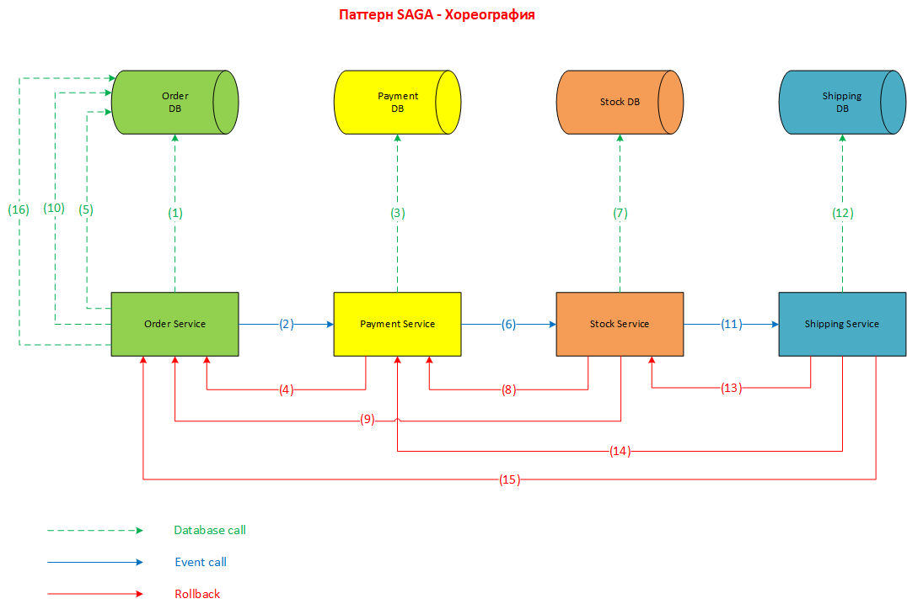

# Домашнее задание
Реализовать распределенную транзакцию.
Реализовать сервисы "Платеж", "Склад", "Доставка".

Для сервиса "Заказ", в рамках метода "создание заказа" реализовать механизм распределенной транзакции (на основе Саги).
Во время создания заказа необходимо:
1) в сервисе "Платеж" убедиться, что платеж прошел
2) в сервисе "Склад" зарезервировать конкретный товар на складе
3) в сервисе "Доставка" зарезервировать курьера на конкретный слот времени.

Если хотя бы один из пунктов не получилось сделать, необходимо откатить все остальные изменения.

# Решение: сценарий реализации паттерна SAGA через оркестрацию

1. Сервис "Заказ" создает запись в БД со статусом "В обработке"

2. Сервис "Заказ" публикует событие "Заказ создан", а сервис "Платеж" слушает это событие

3. Платеж проводится и деньги списываются

4. Если платеж не прошел, то сервис "Платеж" публикует событие "ОТКАТ" c сообщением "Не удалось произвести оплату по заказу", а сервис "Заказ" слушает это событие

5. Обновление в БД "Заказ" статуса заказа "Ошибка оплаты"

6. Сервис "Платеж" публикует событие "Платеж проведен", а сервис "Склад" слушает это событие

7. Сервис "Склад" резервирует кол-во товара по заказу

8 и 9. Если при резервировании происходит ошибка, то сервис "Склад" публикует событие "ОТКАТ" с сообщением "Не удалось зарезервировать товар по заказу", а сервисы "Платеж" и "Заказ" слушают это событие

10. Обновление в БД "Заказ" статуса заказа "Ошибка резервирования товара"

11. Сервис "Склад" публикует событие "Товар зарезервирован", а сервис "Доствка" слушает это событие

12. Создается запись о доставке в БД "Доставка"

13 и 14 и 15. Если при сохранении информации о доставке происходит ошибка, то сервис "Доставка" публикует событие "ОТКАТ" с сообщением "Не удалось зарезервировать курьера", а сервис "Склад", "Платеж", "Заказ" слушают это событие

16. Обновление в БД "Заказ" статуса заказа "Ошибка доставки товара"
